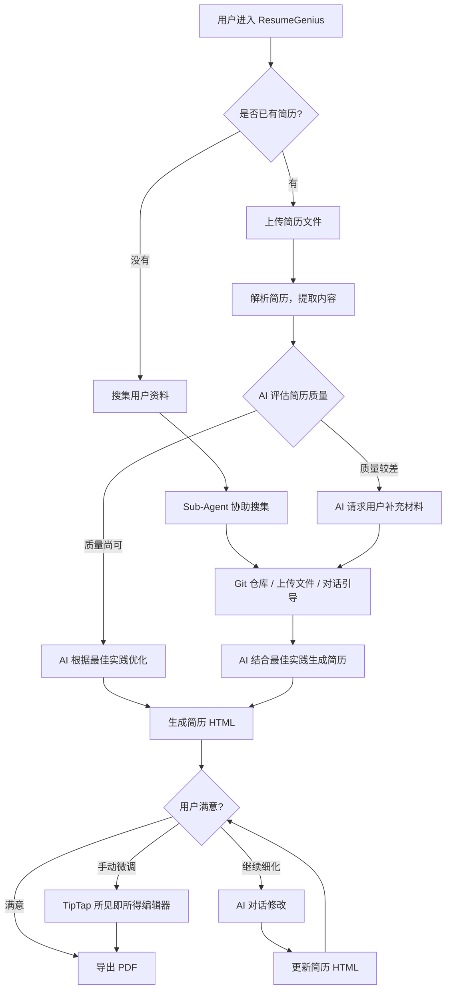
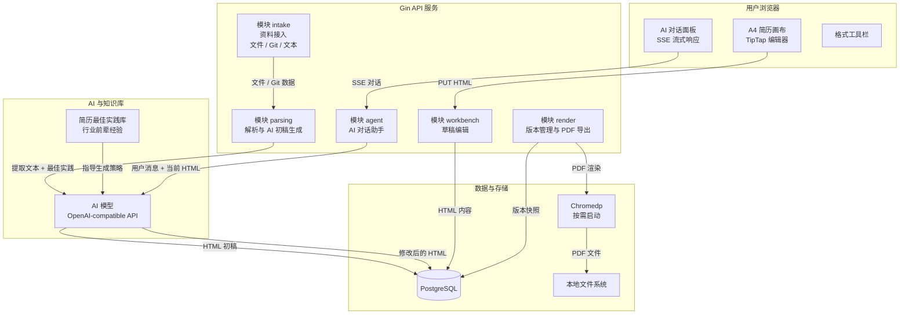
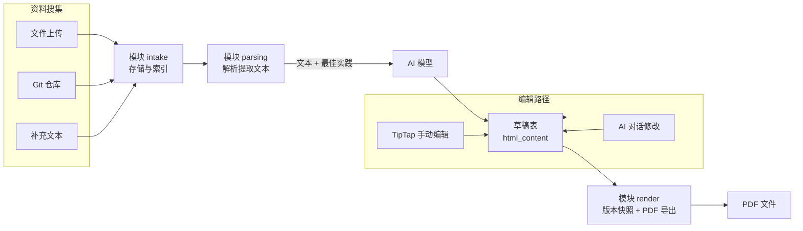
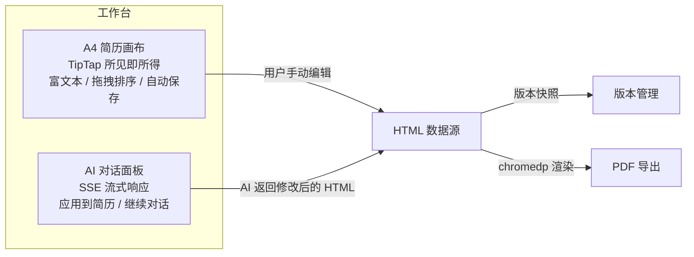

# ResumeGenius

AI 驱动的简历生成与优化平台。无论用户是否已有简历，系统都能帮助生成一份高质量的、符合最佳实践的简历，并提供 AI 对话和所见即所得编辑器进行细化调整。

## 产品定位

ResumeGenius 服务两类用户，但最终走向同一条路径：**AI 结合行业最佳实践，生成一份可用的简历**。

### 无简历的用户

这类用户没有现成简历，但手头有自己的资料 -- 项目经历、工作履历、技术栈等。ResumeGenius 通过子代理（Sub-Agent）帮助用户搜集和整理散落在各处的信息：

- Git 仓库：自动提取项目名称、技术栈、README 描述
- 上传的文件：PDF、DOCX 等原始材料
- 用户口述：通过对话引导用户补充关键信息

同时，ResumeGenius 整合了各行业资深前辈的面试经验与简历最佳实践，AI 在生成简历时不是简单地罗列信息，而是按照行业认可的结构和表达方式来组织内容。用户拿到初稿后，可以手动微调，也可以继续通过 AI 对话细化。

### 有简历的用户

这类用户已有简历，希望优化。系统解析现有简历后，AI 根据最佳实践进行评估和优化。如果原简历质量尚可，AI 直接给出改进版本；如果原简历质量较差，AI 会主动询问用户并请求补充材料，然后重新生成 -- 此时流程与无简历用户一致。

### 用户旅程总览



两条路径最终汇合到同一个编辑工作台，用户可以在 AI 对话和手动编辑之间自由切换。

## 市场对比

### 与简历模板平台对比（Canva / Fotor / WonderCV）

模板平台的核心交互是"选模板 + 填内容"，面向从零制作简历的用户。用户需要自己想清楚每一项怎么写，平台只提供排版框架。

ResumeGenius 的差异在于：AI 主动帮用户组织和表达内容。用户不需要面对空白模板发呆，只需要提供原始材料（甚至是散乱的资料），AI 结合行业最佳实践直接生成可用的简历。

### 与 AI 简历工具对比（Kickresume / Teal / Resume Worded）

这类工具通常采用"结构化表单 + AI 润色"的模式，用户在预设字段中填写信息，AI 辅助优化措辞。局限在于：表单结构是固定的，排版调整空间有限，且 AI 只能做文本层面的润色，无法重构简历的整体结构和排版。

ResumeGenius 的差异在于：

- 没有表单约束。TipTap 所见即所得编辑器让用户像编辑 Word 一样自由调整排版
- AI 不只是润色文本，而是直接操作 HTML，可以重构整个简历的结构和样式
- Sub-Agent 主动搜集用户资料，降低用户的输入负担

### 核心优势

| 维度 | 模板平台 | 表单式 AI 工具 | ResumeGenius |
|------|---------|-------------|-------------|
| 内容生成 | 用户自己写 | AI 润色已有内容 | AI 结合最佳实践直接生成 |
| 资料搜集 | 无 | 无 | Sub-Agent 自动搜集 |
| 编辑自由度 | 模板约束 | 表单字段约束 | 所见即所得，无约束 |
| AI 修改范围 | 无 | 文本润色 | 内容 + 排版全链路 |
| 导出一致性 | 依赖平台渲染 | 依赖平台渲染 | 服务端渲染，所见即所得 |
| 最佳实践融入 | 靠用户自己判断 | 部分 ATS 优化建议 | 行业前辈经验系统化嵌入 |

## 架构设计

### 核心原则

**HTML 是唯一数据源。** 从 AI 生成到用户编辑到 PDF 导出，全链路只操作 HTML 这一种格式。

- AI 直接生成或修改 HTML，不走 Patch 协议或结构化中间层
- TipTap 编辑器直接编辑 HTML，编辑即预览，零延迟
- chromedp 服务端渲染 HTML 为 PDF，保证导出与屏幕一致

### 系统架构



### 数据流



两条并行的编辑路径（AI 对话和手动编辑）共享同一份 HTML 数据，用户可以自由切换，无需同步中间状态。

### 模块划分

五个模块按业务闭环划分，各自独立开发、独立测试，通过 API 契约对齐：

| 模块 | 职责 | 核心输入 | 核心产出 |
|------|------|---------|---------|
| intake 资料接入 | 项目管理、文件上传、Git 接入、Sub-Agent 搜集 | 用户操作 | 文件元信息、assets 记录 |
| parsing 解析初稿 | 文件解析、AI 结合最佳实践生成 HTML 初稿 | 原始文件 + 最佳实践 | drafts.html_content |
| agent AI 对话 | 多轮 SSE 对话，AI 返回 HTML | 用户消息 + 当前 HTML | 修改后的 HTML |
| workbench 可视化编辑 | TipTap 所见即所得编辑器 | HTML 内容 | 编辑后的 HTML |
| render 版本导出 | HTML 快照 + chromedp PDF 导出 | 当前 HTML | 版本记录 + PDF 文件 |

## 技术栈

| 层 | 技术 | 选型理由 |
|---|------|---------|
| 营销站 | Astro | 纯静态输出，SEO 友好，零 JS 开销 |
| 工作台 | Vite + React + TypeScript + Tailwind CSS + shadcn/ui | 高性能 SPA，组件化开发 |
| 富文本编辑器 | TipTap (ProseMirror) | 所见即所得，完善的富文本 API |
| 后端 | Gin + Go + GORM | 单二进制部署，内存占用低 |
| 数据库 | PostgreSQL >= 15 | 成熟稳定，JSONB 支持灵活元数据 |
| 文件解析 | ledongthuc/pdf + nguyenthenguyen/docx | 纯 Go 实现，无外部运行时依赖 |
| PDF 导出 | chromedp | 按需启动 Chromium，渲染保真度高 |
| AI 模型 | OpenAI-compatible API | Provider Adapter 解耦，支持任意兼容模型 |

## 部署方案

```yaml
# docker-compose.yml -- 三个容器，一键启动
services:
  nginx:       # 静态文件托管 + API 反代，约 10MB
  gin:         # Go API 服务，约 50MB
  postgres:    # 数据库，约 500MB
```

空闲时总内存约 560MB，导出 PDF 时临时增加约 300MB（Chromium 进程，2-5 秒后释放）。2C2G 服务器完全够用。

## 工作台交互

工作台是用户与简历交互的核心界面，参考 Google NotebookLM 的克制风格，只做两件事：编辑简历、与 AI 对话。

左侧是 A4 尺寸的简历画布（TipTap 所见即所得编辑器），右侧是可收起的 AI 对话面板。编辑即预览 -- 用户在画布中看到的内容就是最终导出的 PDF，不存在"编辑模式"与"预览模式"的切换。



用户可以在 AI 对话和手动编辑之间随时切换，两条路径共享同一份 HTML 数据，不存在同步问题。

## 项目状态

当前处于预实现规划阶段，所有设计文档已就绪，准备进入开发。

| 阶段 | 内容 | 状态 |
|------|------|------|
| 架构设计 | v2 架构设计文档（已批准） | 已完成 |
| 数据模型 | 6 张核心表结构定义 | 已完成 |
| 模块契约 | 5 个模块的 API 契约与工作拆分 | 已完成 |
| UI 规范 | 设计系统、色彩、字体、组件规范 | 已完成 |
| 共享规范 | 技术栈、功能划分、API 规约、Mock 策略 | 已完成 |
| 基础搭建 | 前后端脚手架、数据库初始化、fixtures | 待开始 |
| 核心功能 | 各模块独立开发（mock 驱动） | 待开始 |
| 联调集成 | 模块间联调、端到端测试 | 待开始 |

## 文档导航

设计文档位于 `docs/` 目录，采用契约驱动开发模式。详细目录见 [`docs/README.md`](docs/README.md)。

快速入口：

- 产品需求：[`docs/prd_v2.md`](docs/prd_v2.md)
- 架构设计：[`docs/superpowers/specs/2026-04-23-architecture-v2-design.md`](docs/superpowers/specs/2026-04-23-architecture-v2-design.md)
- 数据模型：[`docs/02-data-models/core-data-model.md`](docs/02-data-models/core-data-model.md)
- API 规约：[`docs/01-product/api-conventions.md`](docs/01-product/api-conventions.md)
- UI 规范：[`docs/01-product/ui-design-system.md`](docs/01-product/ui-design-system.md)
